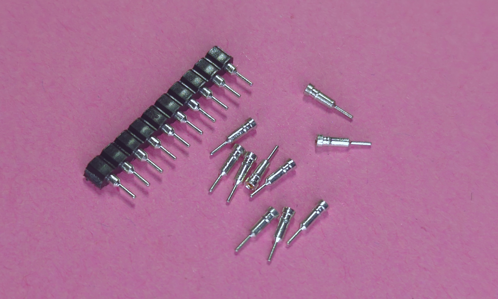

+++
title = "Making invisible IC sockets"
summary = "Method for making custom and invisible IC sockets for PCB."
tags = ["diy", "electronic", "pcb"]
date = 2025-06-30
draft = false
toc = true
+++

## Context

For context, I'm currently building an electronic clock that would need some ICs.
Wishing the clock to be repairable, I opted to use some IC sockets to be able to replace some components.

Wanting also to keep a good aesthetic for this project, I don't want big and ugly sockets on my board.
After racking my head for a simple and cost effective solution, I remembered the female header pins I had purchased a while ago but never used because they were too small for standard 2.54mm male pins to fit in.
But, it turns out that these pins are the perfect hole size for components like ICs and a lot of passives!

## Making the socket

The main advantages of this solution are the `aesthetic` but also the ability to make `sockets for anything` _(as long as the component legs fit in the socket holes)_!
In this post I will show how to make an _invisible_ socket for an 8 pin IC.

{{
}}
- Smalls DIP female pins, similar to [these ones](https://www.digikey.com/en/products/detail/aries-electronics/08-0518-10/4206287)
- 1.8mm drill bit
- Small drill and pliers
- Heat-resistant tape
- Soldering iron and tin
{{
}}

 

Here is a picture of the small DIP header female pins I used:

### Extracting the header pins

The first step is to remove the female headers from their plastic enclosure using pliers.

### Drilling the PCB

Now we can make room for these header pins by drilling 1.8mm holes in the PCB.

Here is what the drilling looks like for an 8 pin IC:

### Inserting the header pins

Once the socket holes are drilled, you can press fit the female header pins into their respective holes.
It may be necessary to use some heat-resistant tape to prevent the pins from falling.

Here is a picture of the inserted header pins:

And here is the bottom view:

Note that if you have vertical space constraints, you can cut the end of the pin before soldering it.
But be careful to cut __only the end__ of the pin and not the hole where the IC pin will insert!

### Soldering the pins

Now it's time to solder the pins to the PCB!
As the drilling removed the copper layer around the holes, it's necessary to make a solder bridge between the header pin and an adjacent pad.

And here's what it looks like from the top:

## Final result !!

As you can _(or cannot)_ see, the socket is pretty much invisible from the top!

And the best part about this solution is that I can now replace components without worrying about desoldering them an hour after soldering, because I burned them  ಠ_ಠ...

---
